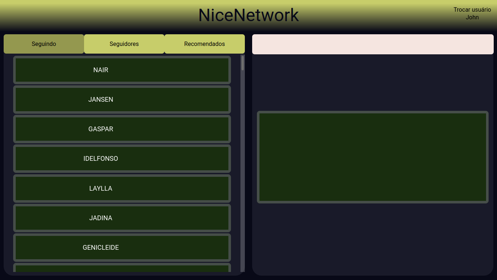
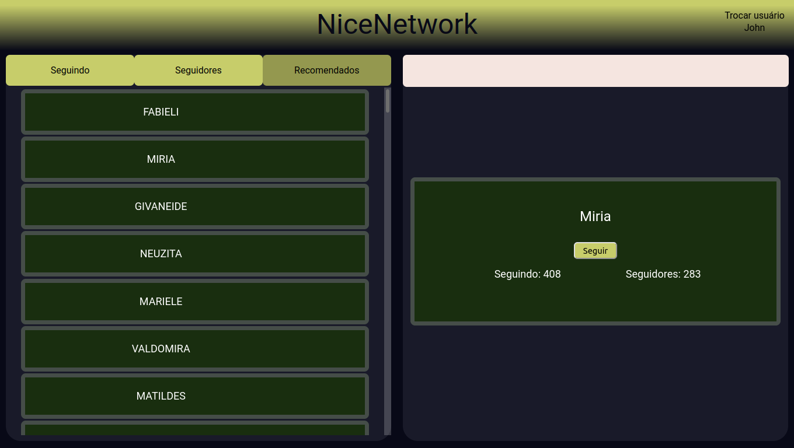
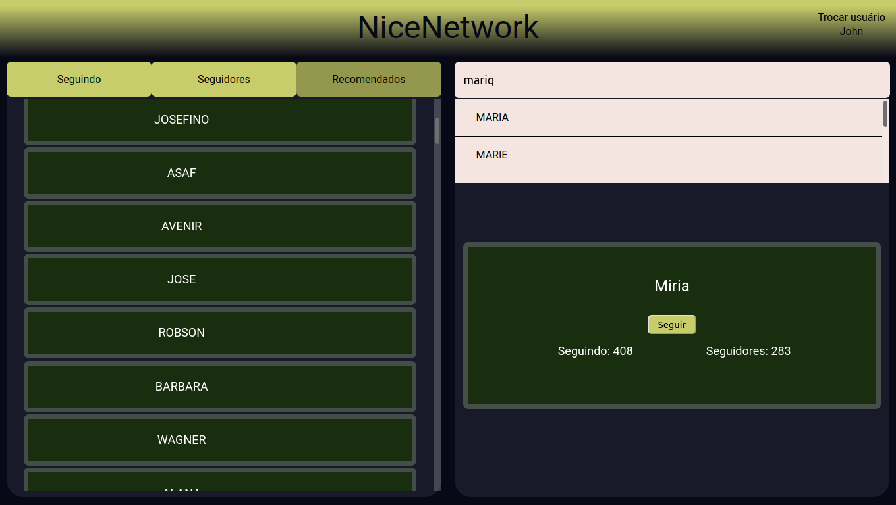
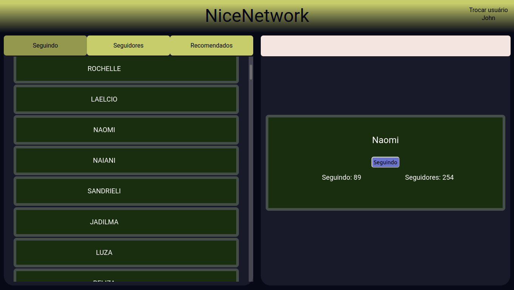

# NiceNetwork

**Número da Lista**: 07<br>
**Conteúdo da Disciplina**: Trabalho Final<br>

## Alunos
|Matrícula | Aluno |
| -- | -- |
| 18/0030272 | Antonio Ruan Moura Barreto |
| 18/0029177 | Wagner Martins da Cunha |

## Sobre
O Nice Network tem o intuito de simular algumas funcionalidades fundamentais de redes sociais, utilizando grafo para representar o ato de uma pessoa seguir outra, e também com programação dinâmica para encontrar nomes de outros usuários semelhantes ao que o usuário digita na barra de busca.

## Screenshots









## Instalação 
**Linguagem**: Python / Javascript<br>
**Framework**: Django / ReactJs<br>

Primeiramente, clone este repositório com:

```
git clone https://github.com/projeto-de-algoritmos/Final_NiceNetwork.git
```

e mude o diretório para o diretório raiz:

```
cd Final_NiceNetwork
```

### Docker
 
#### Pré-requisitos 

- docker
- docker-compose

#### Build

No diretório raíz, realize o build com o comando:

```
docker-compose build
```

#### Execução

Para rodar o projeto, dê o comando:

```
docker-compose up
```

### Execução Manual

Caso prefira não utilizar o Docker, os passos para executar a aplicação de forma manual estão nos seguintes arquivos:

[Backend](./back/README.md)
[Frontend](./front/README.md)

## Uso 

Após o carregamento dos ambientes do backend e do frontend, abra seu navegador no endereço **http://localhost:3000**.

